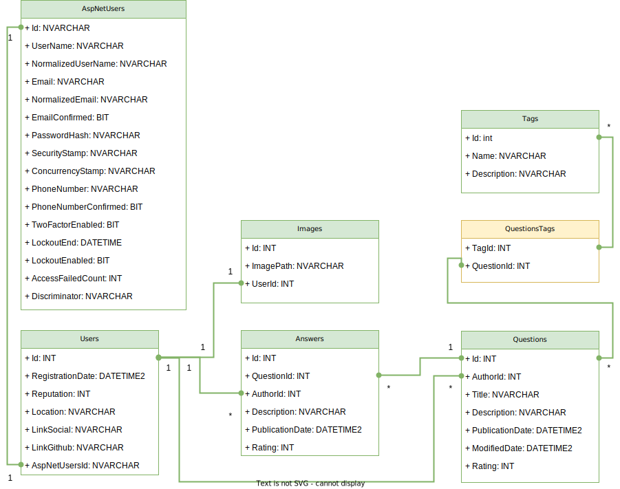

# CodeAnswers
На данный момент сайт размещен на бесплатном хостинге - CodeAnswers.somee.com (www.CodeAnswers.somee.com)
Сайт является обучающим проектом - скромным аналогом StackOverflow.com
## Технологии
1) C#, .NET 8 Core, MVC, 
2) HTML, CSS + bootstrap, JS
3) MS SQL Server
4) Entity Framework (ver 8)
## Схема базы данных


### Триггеры БД
При создании/удалении пользователя в таблице `AspNetUsers` срабатывает триггер, добавляющий/удаляющий пользователя в таблицу `Users`, где хранится дополнительная информация о пользователе.
```sql
CREATE TRIGGER [DeleteUser]
	ON [dbo].[AspNetUsers]
	AFTER DELETE
	AS
	BEGIN
		DELETE FROM Users 
		WHERE Users.name=(SELECT UserName from deleted) 
		AND Users.email=(SELECT Email from deleted)
	END
```
```sql
CREATE TRIGGER [AddNewUser]
	ON [dbo].[AspNetUsers]
	AFTER INSERT
	AS
	BEGIN
		INSERT INTO Users (name, email)
		SELECT UserName, Email
		FROM INSERTED
	END
```
Аналогично при добавлении пользователя в `Users` срабатывает триггер по созданию записи в таблице `Images` (изображение по умолчанию). Если пользователь будет удален из таблицы `Users`, будет произведено каскадное удаление всей информации, которая с ним связана.
```sql
CREATE TRIGGER [AddDefaultImage]
	ON [dbo].[Users]
	AFTER INSERT
	AS
	BEGIN
		INSERT INTO Images (user_id)
		SELECT id
		FROM INSERTED
	END
```
